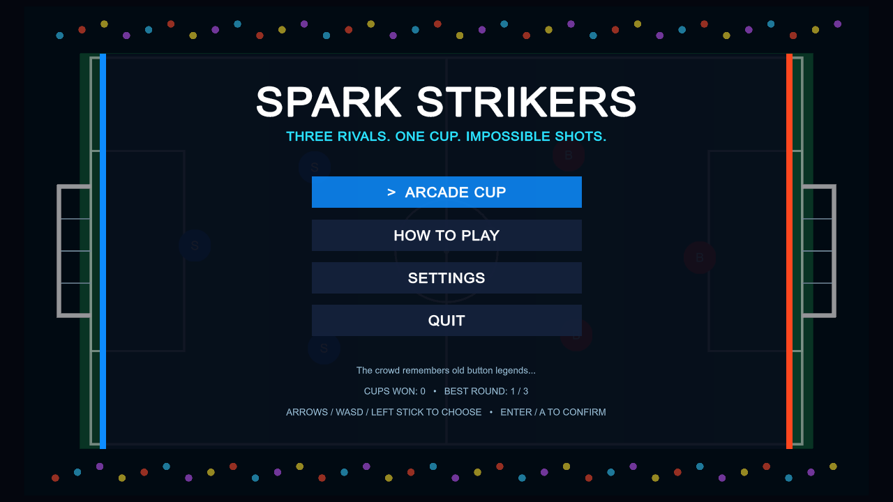
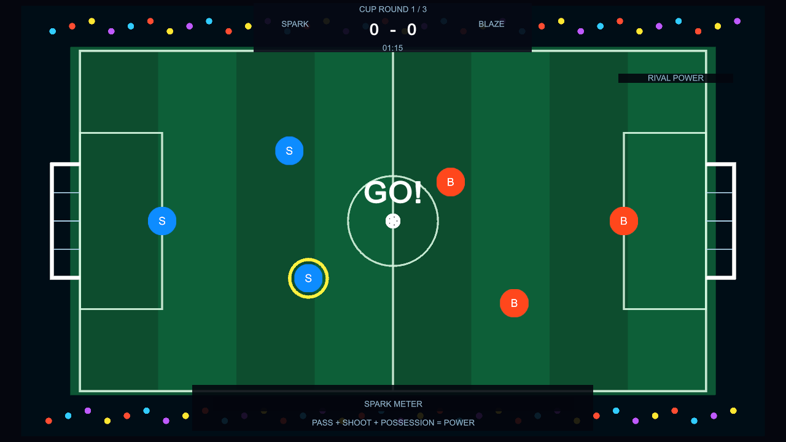

# Spark Strikers

Working-title Unity 2D arcade football game for a future Steam release. A three-rival Arcade Cup combines quick passing, charge shots, escalating AI, rival-specific special moves, procedural sound, persistent records, English/Japanese UI, and unlockable secrets—including a hidden fourth challenger after the first championship.





## Play

1. Open the repository with Unity `6000.3.22f1` (Unity 6.3 LTS).
2. Open `Assets/Scenes/Main.unity`.
3. Enter Play Mode.

Art, effects, and the looping stadium ambience are generated in-game. The included Noto Sans JP font is licensed under OFL 1.1; its notice is in `ThirdPartyNotices.txt` and is copied beside every Windows build.

| Action | Keyboard | Gamepad |
| --- | --- | --- |
| Move | WASD / arrows | Left stick |
| Shoot | Hold and release Z / Space | A |
| Pass | X | X |
| Dash / tackle | Shift | B |
| Switch player | Q | LB |
| Special | C | Y |
| Pause | Esc | Menu |

Menus support the keyboard or left stick, with A to confirm and B to go back.
Windowed play maintains a minimum 1024×576 viewport so menus and HUD text remain readable.

Quit, restart-match, and mid-match return-to-title actions use a confirmation screen that defaults to cancel.
Active matches pause automatically when the game loses focus; returning to the window never resumes play without input.

## Special shots

- `STAR BREAKER` is a fast, straight power shot.
- `BLAZE CANNON` accelerates and has extra knockback.
- `ZERO DRIVE` slows defenders it touches.
- `ECLIPSE ARC` changes direction mid-flight.
- The champion-only `SUPERNOVA STRIKE` launches fastest and weaves through defense.
- The hidden `COMET BREAKER` bends toward goal with a rainbow trail.

The UI defaults to the operating-system language for English or Japanese and can be changed in Settings. ROOKIE, ARCADE, and LEGEND difficulty levels tune rival movement, decisions, and special-shot charge. Screen shake, full-screen flashes, and high-contrast team colors can be changed independently.

A tied match continues as Golden Goal; the next score decides the round immediately.

## Check

Run the engine-independent rules smoke test:

```powershell
dotnet run --project Tools/SmokeTest/SmokeTest.csproj --configuration Release
```

The lightweight Roslyn syntax check is available when Unity is not installed:

```powershell
dotnet run --project Tools/SyntaxCheck/SyntaxCheck.csproj -- Assets
```

## Windows release build

Use `Build > Windows Release` in Unity, or call the same method in batch mode:

```powershell
Unity.exe -batchmode -nographics -quit -projectPath . -executeMethod SparkStrikers.Editor.WindowsReleaseBuild.Build -logFile Builds/build.log
```

The default Mono output is `Builds/Windows/SparkStrikers.exe`. Set `SPARK_BUILD_PATH` to override it and `SPARK_BUILD_VERSION` to stamp the release version shown on the title screen. The build applies the product icon and branding automatically. Switch the build script to IL2CPP after installing Unity's Windows IL2CPP module.

For Steam Auto-Cloud, sync `progress.sav` from root `WinAppDataLocalLow`, subdirectory `Spark Strikers/Spark Strikers`, Windows OS, non-recursive. Display and audio settings remain local in PlayerPrefs so machine-specific preferences are not clouded.
Progress saves use atomic replacement and a validated backup; a damaged primary save repairs itself from that backup on startup.
If progress cannot be written, the game displays a persistent warning instead of silently claiming that the save succeeded.

## Support

Report problems through the [GitHub issue tracker](https://github.com/s-deme/prototype_football2d/issues). Include the game version shown on the title screen, reproduction steps, and the Windows player log from `%USERPROFILE%\AppData\LocalLow\Spark Strikers\Spark Strikers\Player.log`.

Asset origins and release-rights status are tracked in [`AssetProvenance.md`](AssetProvenance.md).

`Steam/StoreAssets/Screenshots` contains five gameplay-only 1920×1080 captures ready for the Steam store screenshot section.

`Steam/StoreAssets/Capsules`, `Library`, and `Community` contain the required store capsules, library artwork, logo, shortcut icon, and app icon. Regenerate their exact sizes and title treatment from the checked-in key-art masters with:

```powershell
pwsh Tools/GenerateSteamCapsules.ps1
```

The generator also rejects missing, extra, misnamed, or incorrectly sized Steam screenshots.
Asset dimensions and content rules follow Valve's current [Steam graphical asset requirements](https://partner.steamgames.com/doc/store/assets?l=english); the library-logo transparency is validated as well.

After making a Windows build, run the complete local release preflight:

```powershell
pwsh Tools/VerifyRelease.ps1
```

It runs the rules and syntax checks, regenerates and validates Steam graphics, verifies required build files and the bundled license notice, then exercises the built player headlessly.
Automated runs use isolated progress and deterministic default settings instead of inheriting local player preferences.

`Steam/StorePageCopy.md` contains paste-ready English/Japanese descriptions, tags, accessibility claims, provisional system requirements, and screenshot alt text. Do not enable unverified Steamworks features listed there as pending.
Its external release-gates section is the handoff checklist for physical QA, SteamPipe, Auto-Cloud, and Valve review.

Verified with Unity `6000.3.22f1`: project import, script compilation, Windows 64-bit Mono release build, one-command release preflight, isolated automation defaults, built-player version/COMET/runtime/save-round-trip/backup-self-repair/Japanese-font/confirmation-flow/focus-loss-pause/hidden-fourth-rival/stadium-loop smoke tests, three tested difficulty curves, English/Japanese title/settings/help/match/results/confirmation captures plus the version label, auto-pause, and NOVA special at 1280×720 and 1024×768, five Steam gameplay captures at 1920×1080, all required Store/Library/Community graphics at their exact dimensions, a 120×45 small-capsule legibility proof, and a high-contrast pass. Windows IL2CPP needs the optional Unity module; hands-on audio/controller coverage, Steam Deck testing, and Steamworks App ID configuration still remain for later product-readiness passes.
